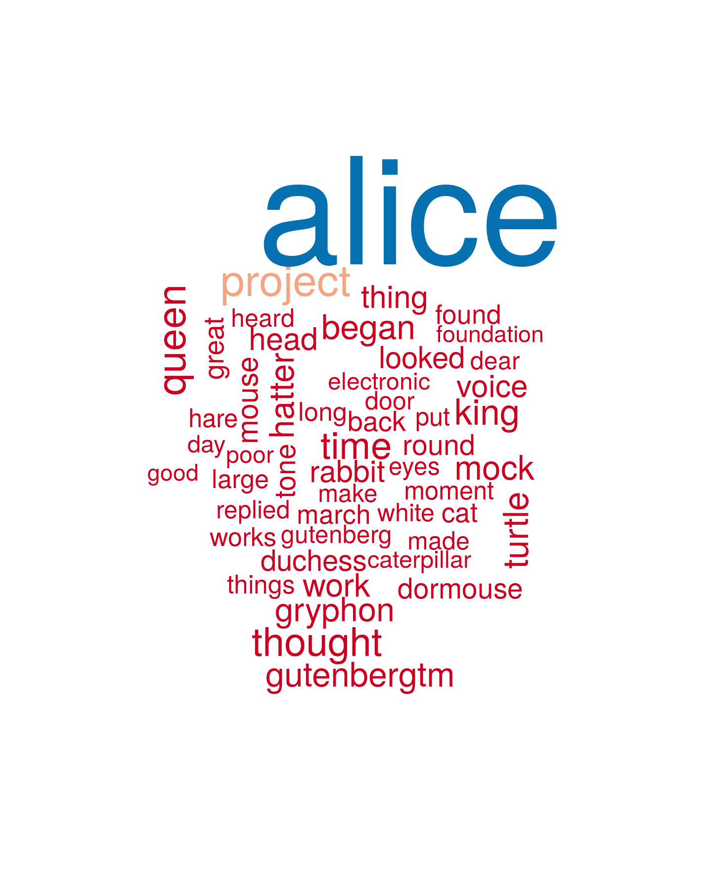

## Now you can:
- Visualize a text
- Get the main topics at a glance
- Find the most important words in a document
 

    

For any text file!

--- .class #id 

## The App: https://gmuldoon.shinyapps.io/Project/
 

    

--- .class #id 

## How to make your wordcloud

Select:
- A text file 
(sample available at https://github.com/gmuldoon/DataProducts-coursera/tree/master)
- Minimum frequency a word must appear to be included
- Maximum number of words to show in the wordcloud
- Whether or not to include punctuation
- Whether or not to include stop words (common words like the, and, etc.)

Note: Numbers are automatically removed, stemmed words are combined, and all words are changed to lower case

--- .class #id 

## 

<!--   -->

The ui.R and server.R for this app are available at: 
 
 
<a href="https://github.com/gmuldoon/DataProducts-coursera/tree/master">https://github.com/gmuldoon/DataProducts-coursera</a>
 
 
 
Modifications are possible to also output the file of word frequency for further analysis: 

<!-- 
 -->

<!-- 
 -->

